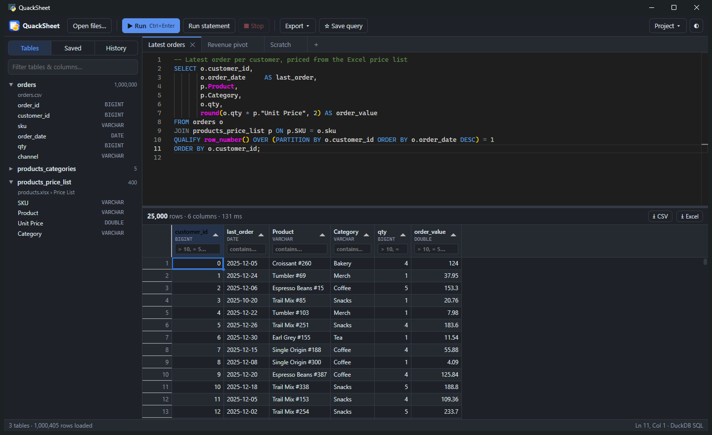
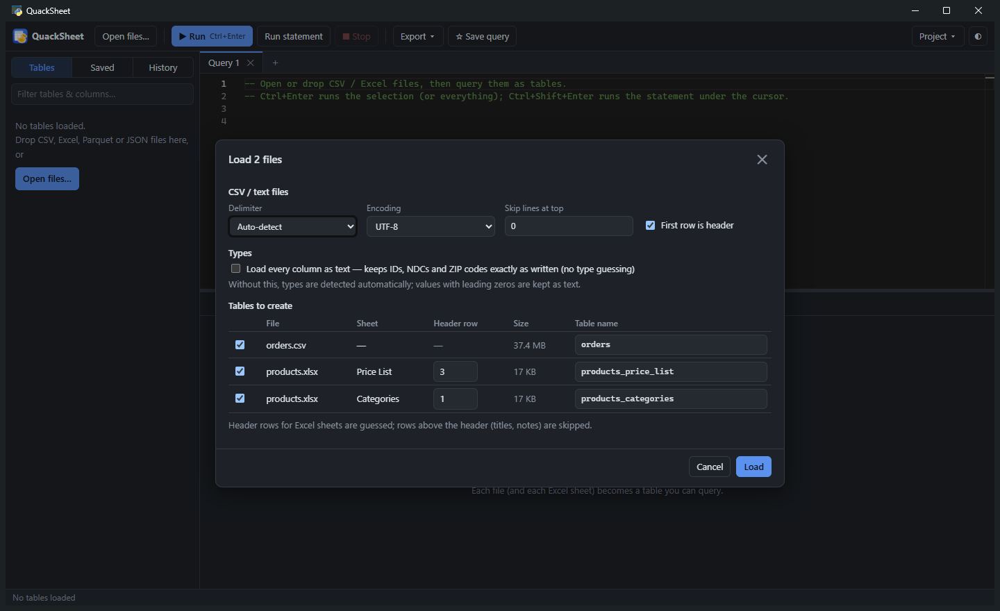
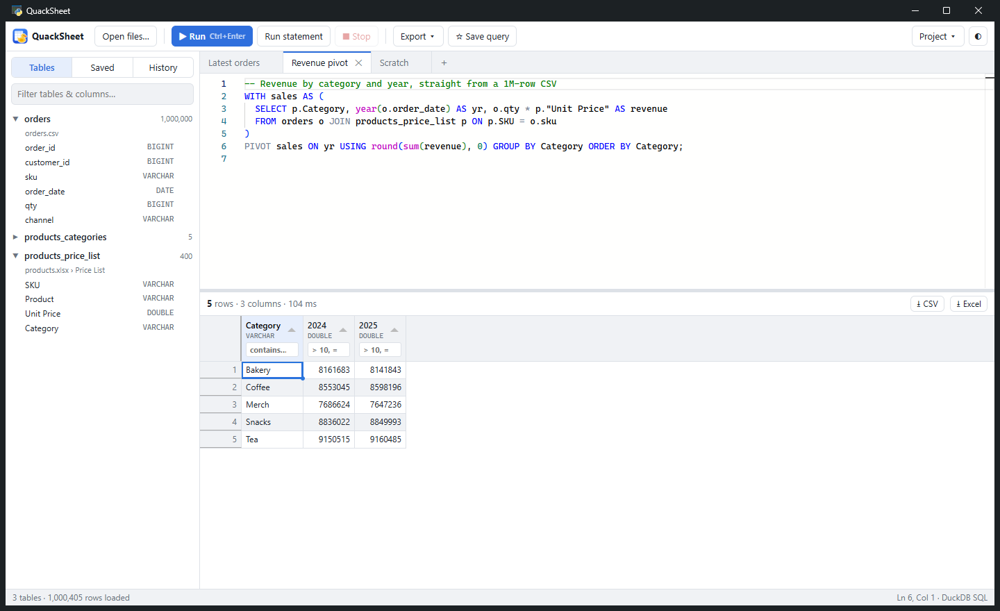
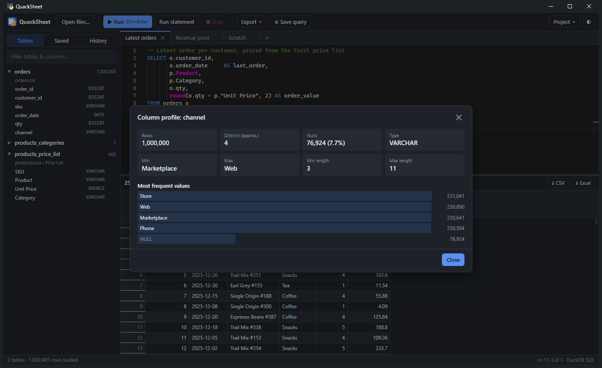
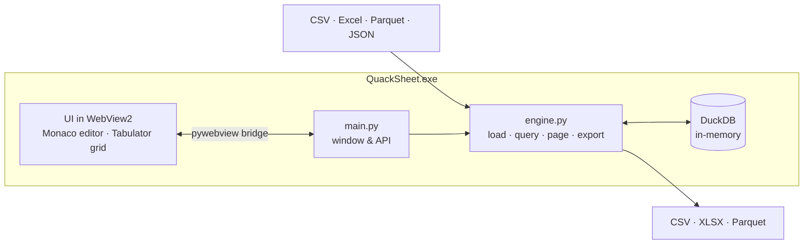

<div align="center">


# QuackSheet

**Query your spreadsheets like a database.** 🦆

Drop in CSV or Excel files, write real SQL against them, and export the results. No database server, no uploads, no Python required.


[**⬇ Download**](../../releases/latest) · [Features](#-features) · [SQL examples](#-sql-you-can-write) · [Build from source](#-build-from-source)



</div>

---

## 🦆 Why QuackSheet?

Excel struggles past a few hundred thousand rows and can't join two files without VLOOKUP gymnastics.
Setting up a database just to answer one question is overkill. QuackSheet sits in between:

- **Instant:** a million-row CSV loads in a couple of seconds, and most queries finish in milliseconds.
- **Real SQL:** window functions, `QUALIFY`, `PIVOT`, CTEs and joins across files, powered by [DuckDB](https://duckdb.org).
- **Private:** everything runs on your machine. Nothing is uploaded, so it's fine for sensitive data.
- **Zero setup:** unzip and double-click. Your colleagues don't need Python, drivers or admin rights.

## ✨ Features

**Load anything tabular**
- CSV, TSV, TXT, Excel (`xlsx`, `xlsm`, `xls`, `xlsb`, `ods`), Parquet and JSON: drag and drop or *Open files…*
- Every file, and every Excel sheet, becomes a table.
- Finds each sheet's header row automatically, skipping report titles and notes above it.
- Keeps IDs such as `000123`, ZIP codes and NDCs as text, so leading zeros survive. You can also load every column as text.
- Notices when a source file changes on disk and offers a one-click reload.

**Write SQL comfortably**
- A VS Code–grade editor (Monaco) with DuckDB syntax highlighting.
- Autocomplete for tables, columns (including `alias.` columns) and hundreds of DuckDB functions.
- Run the selection, everything, or just the statement under the cursor.
- Errors are underlined at the exact line and column, and long queries can be cancelled.
- One-click SQL formatting, multiple query tabs, saved queries and full query history.

**Explore results**
- The grid scrolls through the entire result, even millions of rows. Sorting and filtering run in DuckDB, not just on the visible page.
- Header filters understand `contains`, `=x`, `!=x`, `>5`, `<=10`, `null` and `not null`.
- Select a range and press Ctrl+C to paste into Excel. Right-click to filter to or exclude a value.
- Column profiles show nulls, distinct counts, min/max, averages and the most frequent values.

**Export**
- Results to **CSV**, **Excel** or **Parquet**, using the grid's current sort and filters.
- **All tabs → one workbook:** each query becomes its own sheet.
- Results over Excel's 1,048,576-row limit automatically continue on extra sheets.

**Keep your work**
- **Projects** (`.quack` files) remember your files, import options and query tabs.
- Open and save `.sql` files, with light and dark themes.

<table>
  <tr>
    <td width="33%"><p align="center"><sub><b>Smart import:</b> header rows guessed per sheet</sub></p></td>
    <td width="33%"><p align="center"><sub><b>PIVOT</b> a 1M-row CSV in 93 ms</sub></p></td>
    <td width="33%"><p align="center"><sub><b>Column profile</b> at a click</sub></p></td>
  </tr>
</table>

## 🚀 Getting started

1. Download the latest `QuackSheet-…-windows-x64.zip` from [**Releases**](../../releases/latest).
2. Unzip it anywhere and run **`QuackSheet.exe`**. Keep the `_internal` folder next to it.
3. Drag a CSV or Excel file onto the window, click **Load**, and start querying:

```sql
SELECT * FROM my_file LIMIT 100;
```

> [!NOTE]
> The first time you run it, Windows SmartScreen may say *"Windows protected your PC"* because the app isn't code-signed.
> Click **More info → Run anyway**.

## 🧮 SQL you can write

QuackSheet speaks [DuckDB SQL](https://duckdb.org/docs/sql/introduction), which is PostgreSQL-flavoured with some very handy extras.

<details open>
<summary><b>Latest row per group with <code>QUALIFY</code></b></summary>

```sql
SELECT customer_id, order_date, product, qty
FROM orders
QUALIFY row_number() OVER (PARTITION BY customer_id ORDER BY order_date DESC) = 1;
```
</details>

<details>
<summary><b>Join a CSV to an Excel sheet</b></summary>

```sql
SELECT o.order_id, o.qty, p."Unit Price", o.qty * p."Unit Price" AS revenue
FROM orders o
JOIN products_price_list p ON p.SKU = o.sku;
```
</details>

<details>
<summary><b>Pivot a table</b></summary>

```sql
PIVOT orders ON year(order_date) USING sum(qty) GROUP BY channel;
```
</details>

<details>
<summary><b>Less typing: <code>GROUP BY ALL</code>, <code>EXCLUDE</code>, <code>FILTER</code></b></summary>

```sql
SELECT channel,
       count(*)                            AS orders,
       count(*) FILTER (WHERE qty >= 5)    AS bulk_orders
FROM orders
GROUP BY ALL;

SELECT * EXCLUDE (internal_notes) FROM customers;
```
</details>

<details>
<summary><b>Quick stats for every column</b></summary>

```sql
SUMMARIZE orders;
```
</details>

<details>
<summary><b>Build reusable views</b></summary>

```sql
CREATE VIEW big_orders AS SELECT * FROM orders WHERE qty >= 5;
SELECT channel, count(*) FROM big_orders GROUP BY ALL;
```
</details>

**Coming from SQL Server?** Use `LIMIT 10` instead of `TOP 10`, `"double quotes"` instead of `[brackets]`,
`||` to concatenate strings, and `COALESCE` instead of `ISNULL`.

## ⌨️ Keyboard shortcuts

| Shortcut | Action |
|---|---|
| `Ctrl+Enter` / `F5` | Run selection, or the whole editor |
| `Ctrl+Shift+Enter` | Run the statement under the cursor |
| `Esc` | Cancel the running query |
| `Ctrl+Space` | Autocomplete |
| `Shift+Alt+F` | Format SQL |
| `Ctrl+/` | Toggle comment |
| `Ctrl+S` | Save query |
| `Ctrl+Shift+S` | Save project |
| `Ctrl+O` | Open files |
| `Ctrl+T` / `Ctrl+W` / `Ctrl+Tab` | New / close / next tab |

## ❓ FAQ

<details>
<summary><b>Is my data uploaded anywhere?</b></summary>

No. QuackSheet runs entirely on your computer and makes no network calls. Files are read into an in-memory DuckDB database that disappears when you close the app.
</details>

<details>
<summary><b>How big can my files be?</b></summary>

Millions of rows are routine. DuckDB is a columnar engine built for analytics and can spill to disk when memory runs low. Excel export is limited by Excel itself (1,048,576 rows per sheet), so larger results continue on extra sheets; CSV and Parquet have no limit.
</details>

<details>
<summary><b>Why is a column the wrong type?</b></summary>

Types are detected from the whole file. If a column should stay exactly as written (IDs, codes), tick <b>Load every column as text</b> in the import dialog, or cast in SQL: <code>CAST(col AS VARCHAR)</code>.
</details>

<details>
<summary><b>Where are my saved queries and history stored?</b></summary>

In <code>%APPDATA%\QuackSheet\state.json</code>. Loaded tables aren't kept between sessions; save a <b>project</b> (<code>.quack</code>) to reopen the same files in one step.
</details>

## 🛠 Build from source

Requirements: Windows 10/11, Python 3.12+ (developed on 3.14) and the [WebView2 runtime](https://developer.microsoft.com/microsoft-edge/webview2/) (preinstalled on Windows 11).

```powershell
git clone <this repo>
cd <repo folder>
python -m venv .venv
.\.venv\Scripts\python.exe -m pip install -r requirements.txt

# run it
.\.venv\Scripts\python.exe app\main.py          # add --debug for DevTools

# build dist\QuackSheet\QuackSheet.exe
powershell -ExecutionPolicy Bypass -File build.ps1
```

To ship a release, zip the whole `dist\QuackSheet` folder and attach it to a GitHub release.

## 🧩 How it works



- **Loading:** CSVs are read by DuckDB's `read_csv` with full-file type detection. Excel sheets are read with [calamine](https://github.com/tafia/calamine) (fast, Rust), then typed by DuckDB.
- **Querying:** the last statement's result is stored as a DuckDB table, so the grid pages, sorts and filters it with SQL instead of holding millions of rows in JavaScript.
- **Exporting:** DuckDB's `COPY` writes CSV and Parquet. [XlsxWriter](https://github.com/jmcnamara/XlsxWriter) streams Excel files in constant memory.

| Path | What's there |
|---|---|
| `app/main.py` | Window, file dialogs, drag-and-drop, JS ↔ Python API |
| `app/engine.py` | DuckDB engine: import, run SQL, paging, profiling, export |
| `app/web/` | The UI (`app.js`, `styles.css`), with vendored Monaco, Tabulator and sql-formatter |
| `tools/make_icon.py` | Draws the duck icon (needs Pillow) |
| `build.ps1` | PyInstaller build script |

## 📄 License

[MIT](LICENSE) © 2026 Muhammad Daniyal. Bundled third-party libraries keep their own licenses (MIT/BSD); see the `LICENSE` files under `app/web/vendor/`.

## 🙏 Acknowledgements

QuackSheet stands on the shoulders of
[DuckDB](https://duckdb.org) ·
[pywebview](https://pywebview.flowrl.com) ·
[Monaco Editor](https://microsoft.github.io/monaco-editor/) ·
[Tabulator](https://tabulator.info) ·
[sql-formatter](https://github.com/sql-formatter-org/sql-formatter) ·
[python-calamine](https://github.com/dimastbk/python-calamine) ·
[XlsxWriter](https://github.com/jmcnamara/XlsxWriter) ·
[PyInstaller](https://pyinstaller.org).

<sub>QuackSheet is an independent project and is not affiliated with or endorsed by DuckDB Labs or the DuckDB Foundation.</sub>
