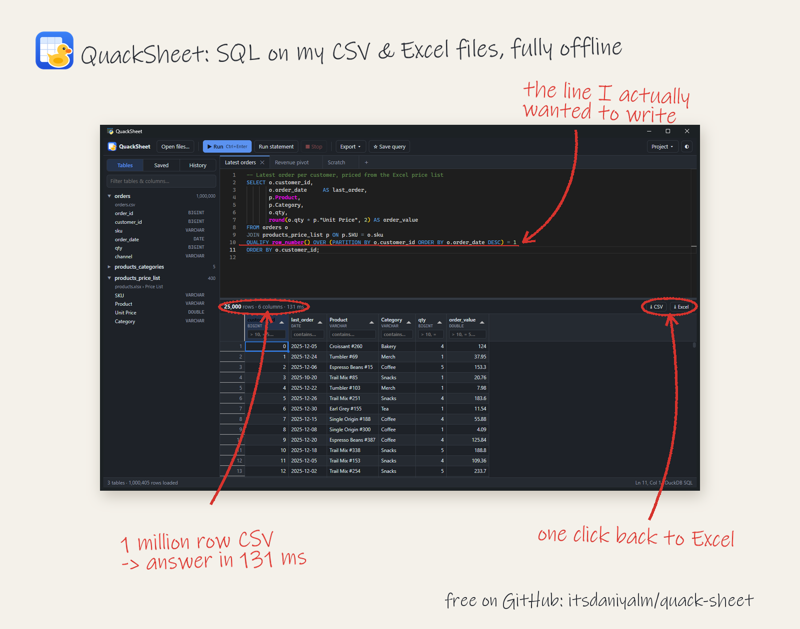
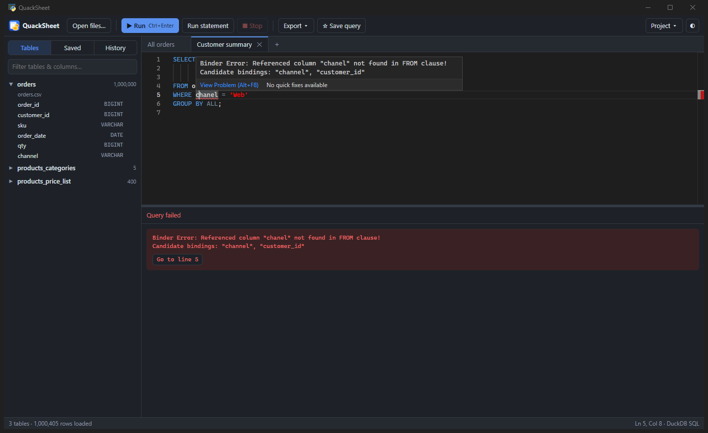
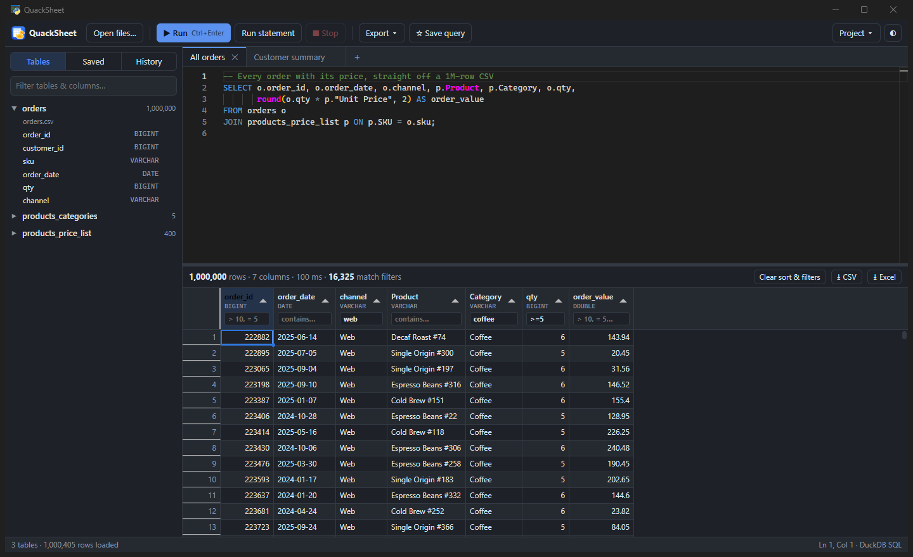
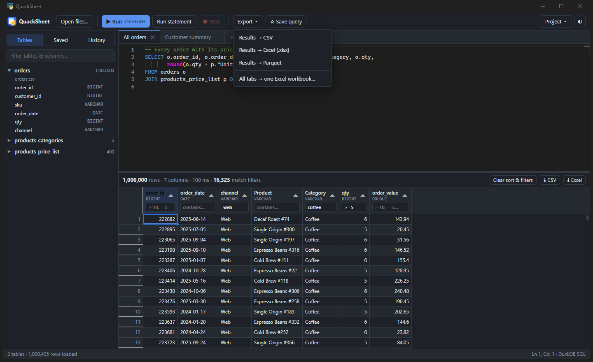

# I got tired of fighting Excel, so I built a tiny SQL app for my spreadsheets

*Meet QuackSheet: drag in a CSV or Excel file, write SQL, export the answer. Free, offline, and it fits in a zip file.*



---

Most of my working day is spent inside files that were never meant to be worked on this hard.

CSV exports. Excel reports with a title row, a blank row, and *then* the headers. Medication lists, pricing files, patient-level extracts. Some are a few thousand rows. Some are a few hundred thousand, and those are the ones where Excel starts thinking about every click.

And almost every question I ask these files is really a SQL question:

- Join this file to that file.
- Keep only the latest row for each patient.
- Count things by month.
- Show me where these two lists don't match.

The problem is that the data isn't in a database. It's sitting in my Downloads folder.

## The two bad options

For a long time I picked between two bad options.

**Option one: fight Excel.** VLOOKUP (or XLOOKUP, if I'm feeling modern). Sort by date, Remove Duplicates, and hope I sorted the right column first. Build a pivot table, then build it again next month because the export layout changed slightly. Wait for the "Not Responding" title bar to go away.

**Option two: load it into a real database.** That works, but it's a lot of ceremony to answer one question. Create a table, fight the import wizard over date formats, notice my IDs lost their leading zeros, fix that, and *then* write the query I wanted to write twenty minutes ago.

There was also an option three I never took: one of those "upload your CSV and chat with it" websites. I work with healthcare data. That data does not get uploaded anywhere, full stop.

What I actually wanted was much simpler:

> Open the file. Write the query. Save the result.

That's it. No server, no setup, no upload.

## So I built it

QuackSheet is a small Windows app that does exactly that. You drop in your files, every file (and every Excel sheet) becomes a table, and you write SQL against them like they've been in a database all along.

The name started as me typing "duckqurey" (typos mine). It's built on DuckDB, ducks quack, and the name stuck. 🦆

Here's what using it actually looks like.

### 1. Drop your files in

You drag files onto the window, or use *Open files…*. Before anything loads, it shows you what it's about to create:


Two small things here that save me real time:

- **It guesses where the header row is.** That Excel report with a title on row 1 and headers on row 3? It picks row 3 by itself. You can change it if it guesses wrong.
- **It keeps leading zeros.** If a column has values like `000123`, it stays text. Your NDCs, ZIP codes and account numbers come out exactly the way they went in. If you don't trust any type guessing at all, there's a checkbox to load everything as text.

### 2. Write the query you actually wanted to write

This is the part I built the whole thing for.


That's a 1-million-row CSV joined to a price list that lives in an Excel file, and it came back in 131 milliseconds. Not a typo.

The line I care about most is this one:

```sql
QUALIFY row_number() OVER (PARTITION BY o.customer_id ORDER BY o.order_date DESC) = 1
```

If you don't speak SQL, here's the plain-English version: *"For each customer, keep only their most recent order."* In Excel that's a sort, a Remove Duplicates, and a quiet prayer that you sorted by the right column first. Here it's one line, and it's right every time.

The editor is the same one VS Code uses, so it has the stuff you'd expect: syntax highlighting, and autocomplete that knows your table and column names. Type `p.` and it lists the columns of whatever `p` is.

### 3. When you mess up, it tells you where

Because I will typo a column name. Every single time.



Instead of a vague "something went wrong", it underlines the exact word, says what's wrong, and even suggests the column I probably meant (`channel`, not `chanel`). It's small, but it's the difference between a two-second fix and a two-minute hunt.

### 4. Poke at the results without writing more SQL

Sometimes I don't want to write another query. I just want to look.



Every column has a filter box. Type `coffee` to match text, `>=5` for numbers, `null` to find the blanks. Here a million rows are filtered down to the 16,325 I care about. The filtering runs in the database, not just on the rows you can see, so the count is real.

There's also a little profile view for any column, which is my favorite thing to check on a file I've never seen before:


Rows, nulls, distinct values, min and max, and the most common values, all in one click. It's the "what am I even looking at" step, done in a second.

### 5. Get it back out

Because the result almost always ends up in Excel anyway (let's be honest, it ends up in an email).



CSV, Excel, or Parquet. My favorite is **All tabs → one Excel workbook**: if you have three queries open in three tabs, you get one file with three sheets, ready to send.

## The little things that make it feel like mine

A few things I added because they annoyed me in other tools:

- **Query tabs, saved queries and history.** That query I wrote last Tuesday is still there.
- **Projects.** Save your files plus your queries as one `.quack` file, and reopen the whole setup next month when the new export lands.
- **It notices when a file changes.** If the CSV gets overwritten with a newer export, it offers a one-click reload.
- **Light and dark mode**, because of course.


## What it's not

I'd rather you know this up front:

- **It's Windows only, for now.**
- **It's not a dashboard or BI tool.** No charts. It's for answering questions, not presenting them.
- **It's not a shared database.** Everything lives in memory on your machine while the app is open. Close it and the tables are gone (your files and saved queries aren't touched, and a project brings it all back in one click).
- **Exporting a huge result to Excel is slower than CSV.** A million-plus rows to `.xlsx` takes about a minute, because that's just how Excel files are built. CSV is instant.

## Could it solve your problem too?

If any of these sound familiar, probably:

- You get the same CSV or Excel export every week or month and redo the same steps on it.
- You need to join two files and VLOOKUP is starting to feel like a personality trait.
- Your files are too big for Excel to be comfortable, but too small to justify a database.
- You work with data that can't leave your laptop: healthcare, finance, HR, customer data.
- You know a bit of SQL (or want an excuse to learn).

You don't need to be a developer. If you can write `SELECT * FROM my_file`, you can use it, and everything else can be picked up one query at a time.

## How it's built (for the curious)

Under the hood it's [DuckDB](https://duckdb.org), a fast analytics database that runs inside the app instead of on a server. That's where the speed comes from. Around it there's a small Python app with a web-style interface, using the Monaco editor from VS Code and a grid that pages through results instead of loading millions of rows at once.

I also want to be honest about how it got built: I built it in a day, with Claude Code as my pair programmer. I came in with the problem and the opinions (what it should feel like, what my files look like, which SQL features I couldn't live without), and we went from "let's brainstorm" to a packaged app the same evening. It still feels a little ridiculous to type.

## Try it

It's free and open source.

1. Download the zip from the [GitHub releases page](https://github.com/itsdaniyalm/quack-sheet/releases/latest).
2. Unzip it anywhere and double-click **QuackSheet.exe**. No installer, no admin rights, no Python.
3. Drag in a CSV or Excel file and run `SELECT * FROM your_file LIMIT 100`.

Windows might show a blue "Windows protected your PC" box the first time, because the app isn't signed (signing certificates cost money and this is a side project). Click **More info → Run anyway**.

If it breaks on one of your files, I genuinely want to know. Open an issue on [GitHub](https://github.com/itsdaniyalm/quack-sheet), or just reply here. And if it saves you even one afternoon of VLOOKUPs, tell me about that too. That's the whole reason it exists.

Quack. 🦆

---

*QuackSheet is an independent project and isn't affiliated with DuckDB. It's MIT-licensed, so feel free to poke around the code.*
